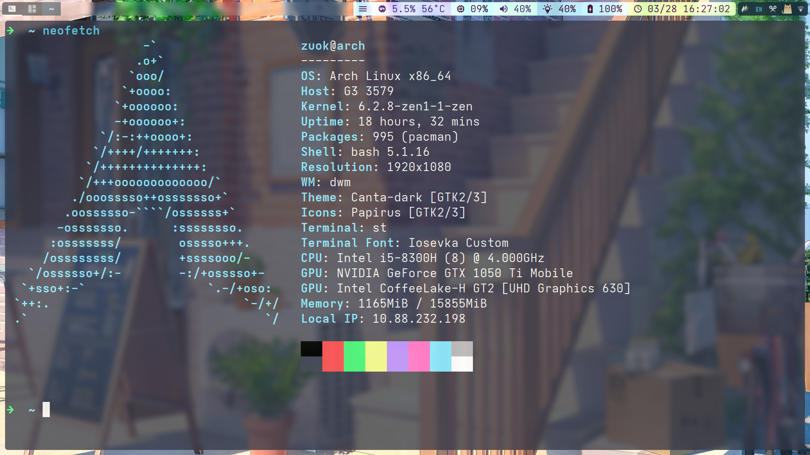

# Archlinux 基本配置指南

tips：内容可能过时，以 wiki 为准

1. 系统概要

   

2. 配置软件源和 aur

   编辑 **/etc/pacman.conf** ,在末尾加上

   ```
   [archlinuxcn]
   SigLevel = OPtional TrustAll
   Server = https://mirrors.ustc.edu.cn/archlinuxcn/$arch
   ```

   编辑/etc/pacman.d/mirrorlist，开头加上

   ```
   Server = http://mirrors.ustc.edu.cn/archlinux/$repo/os/$arch
   Server = https://mirrors.ustc.edu.cn/archlinux/$repo/os/$arch
   ```

   安装 GPG key

   ```
   sudo pacman -Syu
   sudo pacman -S archlinuxcn-keyring
   ```

   aur 包管理器

   ```
   sudo pacman -S paru
   ```

3. 图形界面

   ```
   #基础环境
   paru -S xorg-server xorg-xinit
   paru -S ttf-dejavu ttf-nerd-fonts-symbols-common  ttf-nerd-fonts-symbols-1000-em ttf-twemoji wqy-microhei noto-fonts noto-fonts-cjk
   ```

   Iosevka 字体需要自定义
   https://typeof.net/Iosevka/customizer

   suckless 系列
   https://github.com/Juvenileone/suckless

   picom 混成器
   https://github.com/Juvenileone/picom

   ```
   编译安装
   cd picom

   rm -rf build
   LDFLAGS="-L/usr/local/lib" CPPFLAGS="-I/usr/local/include" meson --buildtype=release . build
   ninja -C build
   sudo ninja -C build install

   picom --experimental-backends --config ~/scripts/config/picom.conf

   使用
   picom --experimental-backends --config /path/to/picom.conf
   ```

4. 输入法（ibus 和 fcitx5 二选一）

   ```
   #ibus（推荐）
   paru -S ibus ibus-libpinyin

   在 /etc/environment 写入：
   export GTK_IM_MODULE=ibus
   export XMODIFIERS=@im=ibus
   export QT_IM_MODULE=ibus
   ```

   ```
   #fcitx5
   paru -S fcitx5 fcitx5-chinese-addons fcitx5-gtk fcitx5-qt fcitx5-material-color

   在 /etc/environment 写入：
   GTK_IM_MODULE=fcitx
   QT_IM_MODULE=fcitx
   XMODIFIERS=@im=fcitx
   SDL_IM_MODULE=fcitx
   ```

5. 软件

   - 系统软件

   ```
   paru -S acpi tlp   #电源管理
   paru -S acpilight  #亮度控制
   paru -S alsa-utils #声卡驱动
   paru -S pulseaudio pulseaudio-alsa pulseaudio-bluetooth   #音频管理
   paru -S bluez blueman #蓝牙
   paru -S mesa lib32-mesa mesa-demos  #intel驱动
   paru -S nvidia-dkms nvidia-utils nvidia-settings nvidia-prime   #nvidia驱动
   paru -S networkmanager network-manager-applet  #网络管理
   ```

   - 日用软件

   ```
   paru -S fish   #shell
   paru -S google-chrome firefox #浏览器
   paru -S vscodium  #代码编辑器
   paru -S gimp feh   #图像编辑，查看
   paru -S flameshot    #截图
   paru -S goldendict   #翻译
   paru -S timeshift gparted openssh   #备份，分区，ssh
   paru -S virtualbox virtualbox-host-dkms linux-zen-header    #虚拟机，header选择使用的内核选择,这里是zen版本
   paru -S deepin-wine-wechat wemeet-bin #微信，腾讯会议
   paru -S lxappearance #主题管理
   paru -S pcmanfm libmtp gvfs-mtp gvfs-nfs #文件管理,后面的用于方便挂载硬盘
   paru -S ranger #终端文件管理器
   paru -S vlc mpv #视频播放
   paru -S unzip-natspec unarchiver #前者替代unzip,解决解压中文乱码,后者万能解压
   paru -S xarchiver #图形压缩/解压软件
   paru -S jdk11-openjdk jdk8-openjdk  #java
   paru -S clash clash-for-windows-bin  #代理
   paru -S copyq  #剪贴板
   paru -S redshift  #护眼
   paru -S dunst  #通知
   paru -S wps-office wps-office-mui-zh-cn ttf-wps-fonts  #wps
   paru -S zotero #文献管理
   paru -S neovim #终端代码编辑器
   paru -S spotify #音乐
   ```

   - 补充：

   goldendict 字典下载
   https://github.com/skywind3000/ECDICT

   dunst 的配置文件在 dwm 里面，需要链接（ln -s）到/etc/dunst/

   neovim 配置https://github.com/Juvenileone/nvim
